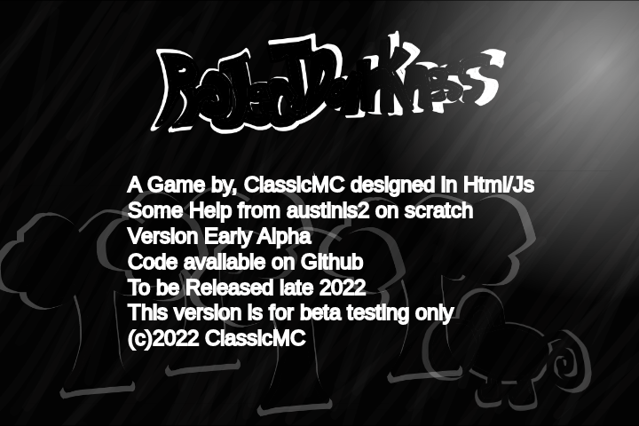

# ProjectDarkness  
<!-- -->

  
Info

  <ul>
    <li>A game by, ClassicMC</li>
    <li>Made in Html Canvas and Js</li>
    <li>&copy;ClassicMC-Studios 2022</li>
    <ul>
      <li>Play online at <a href = "https://projectdarkness.w3spaces.com">projectdarkness.w3spaces.com</a></li>
    </ul>
  </ul>

  
ScreenShots (in progress)

  
  
<em>&copy;ClassicMC</em>

